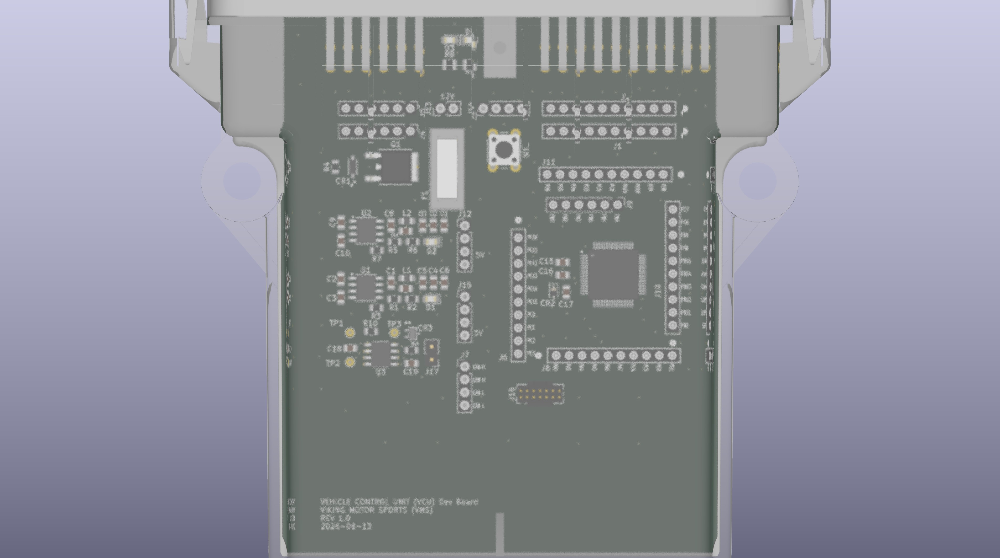
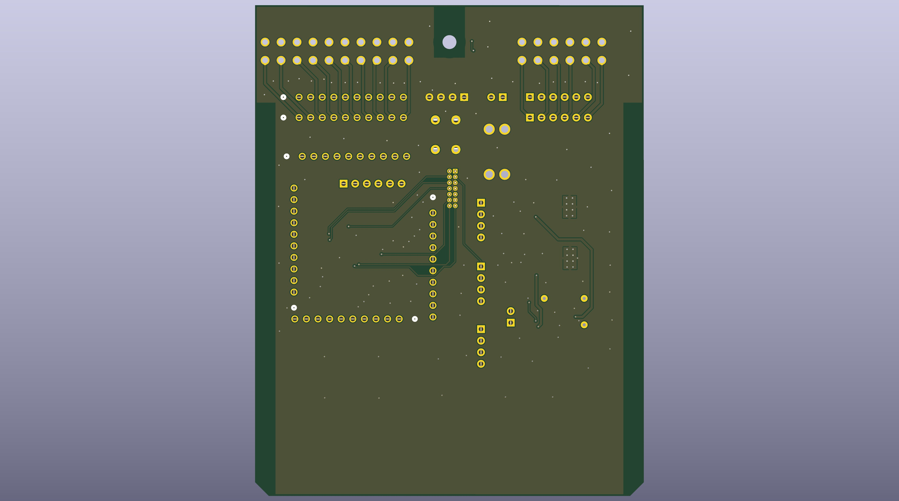

# Viking Motorsports VCU Module

A custom STM32C092RCT6 development and vehicle-control PCB designed specifically for the Viking Motorsports Formula SAE Electric vehicle control system.

The board is designed to fit inside a **Cinch enclosure** and provide a flexible interface between the STM32 microcontroller and the vehicle's external wiring harness. Rather than creating a dedicated PCB for every vehicle-control function, this board provides a common hardware platform that can be configured for different VCU applications.

> **Status:** Hardware Development / Prototype

---

## Board Overview

The VCU Module is a Viking Motorsports-specific development board centered around the **STM32C092RCT6** microcontroller.

The board provides:

- STM32C092RCT6 microcontroller
- CAN bus interface
- Power and ground distribution
- Accessible MCU GPIO and peripheral pins
- Internal configuration headers
- 12-pin external connector
- 20-pin external connector
- Flexible mapping between MCU peripherals and external connector pins
- PCB designed around a Cinch enclosure

The primary design goal is **hardware reuse**. The same PCB can be used for different vehicle-control applications by changing the connections between the MCU peripheral headers and the external enclosure connectors.

---

## Design Concept

The VCU Module separates the vehicle wiring interface from the microcontroller's fixed pin assignments.

```text
                  ┌──────────────────────────────┐
                  │       STM32C092RCT6          │
                  │                              │
                  │   GPIO / ADC / PWM / CAN     │
                  └──────────────┬───────────────┘
                                 │
                         Internal Headers
                                 │
                  ┌──────────────┴───────────────┐
                  │                              │
                  │   User Configurable Wiring   │
                  │                              │
                  └──────────────┬───────────────┘
                                 │
                    ┌────────────┴────────────┐
                    │                         │
              ┌─────▼─────┐             ┌─────▼─────┐
              │ 12-Pin    │             │ 20-Pin    │
              │ Connector │             │ Connector │
              └─────┬─────┘             └─────┬─────┘
                    │                         │
                    └───────────┬─────────────┘
                                │
                       Vehicle Wiring Harness
````

The external connector pinout does not need to be permanently tied to a specific MCU peripheral.

Instead, the board provides internal headers that allow the desired MCU pins to be manually connected to:

* External connector pins
* Power
* Ground
* CAN signals
* Other required vehicle interfaces

This allows the same board design to support different VCU modules without requiring a new PCB layout for each application.

---

## External Interfaces

### 12-Pin Connector

The 12-pin connector provides one of the primary interfaces between the PCB and the vehicle wiring harness.

The individual pins can be assigned to the required MCU signals using the internal configuration headers.

Possible uses include:

* Digital inputs
* Digital outputs
* ADC inputs
* PWM outputs
* Power
* Ground
* Other low-voltage vehicle signals

The exact pin assignment is application-dependent.

### 20-Pin Connector

The 20-pin connector provides additional connections to the vehicle harness.

Like the 12-pin connector, its signals are configurable through the internal headers.

This allows the connector interface to be adapted for different VCU applications while keeping the PCB itself unchanged.

---

## Internal Configuration Headers

One of the primary features of the VCU Module is the collection of internal pin headers.

These headers expose the STM32 peripherals and allow them to be manually connected to the external connector pins.

The headers provide access to:

* MCU GPIO
* ADC-capable pins
* PWM-capable pins
* CAN signals
* 3.3 V / board power
* Ground

This configuration approach allows a single PCB design to be used for multiple vehicle-control modules.

For example, the same board could be configured as:

```text
Pedal Module
    │
    ├── ADC → Accelerator
    ├── ADC → Brake
    └── CAN → Vehicle Network
```

or:

```text
Motor Controller
    │
    ├── CAN → Vehicle Network
    ├── PWM → Motor H-Bridge
    └── GPIO → Control / Enable Signals
```

without changing the underlying PCB design.

---

## CAN Interface

The board includes a dedicated CAN interface for communication with the vehicle control network.

The CAN interface provides:

* CAN TX
* CAN RX
* CAN bus connections
* Access to CAN signals through the board's internal configuration system

The VCU Module is intended to operate as a node on the Formula SAE Electric vehicle CAN network.

CAN message definitions and vehicle communication protocols are documented separately in the main VCU repository.

---

## Power

The board includes dedicated power circuitry and power distribution for the STM32 and associated peripherals.

Power and ground are also made accessible through the internal headers so that external signals can be configured without requiring additional wiring to the PCB.

The power section is separated into its own KiCad schematic sheet for clarity.

---

## Schematic Organization

The KiCad project is divided into several schematic sections:

```text
VCU_Module.kicad_sch
│
├── MCU.kicad_sch
│   └── STM32C092RCT6 and MCU peripherals
│
└── POWER.kicad_sch
    └── Power input and power distribution
```

The top-level `VCU_Module.kicad_sch` integrates the individual schematic sections into the complete board design.

---

## Intended Use

This board is intended to serve as the standard **Viking Motorsports VCU development platform**.

The goal is to avoid designing a new PCB whenever a new vehicle-control function requires a different combination of MCU peripherals.

Instead:

1. Select the required MCU peripherals.
2. Connect those peripherals to the appropriate internal headers.
3. Connect the headers to the desired external connector pins.
4. Install the board into the Cinch enclosure.
5. Develop the corresponding Zephyr application.

This creates a common hardware platform for future VCU development.

---

## Example Applications

The board can be configured for a variety of vehicle-control functions, including:

### Pedal Input Module

```text
Accelerator ──> ADC
Brake ────────> ADC
CAN ──────────> CAN Interface
```

### Motor Controller Module

```text
CAN ──────────> CAN Interface
PWM ──────────> Motor H-Bridge
GPIO ─────────> Enable / Control
```

### Future VCU Modules

The configurable hardware architecture allows future modules to be developed without creating a completely new PCB for each function.

---

## Enclosure

The PCB is designed to fit within a **Cinch 5810130065 4x3.35 ME enclosure** and utilizes the **Cinch 5810132011 32 pos. ME-MX header**


The external 12-pin and 20-pin Molex MX150 connectors provide the interface to the vehicle wiring harness while the configurable headers remain accessible inside the enclosure.

This provides a clean separation between:

* Vehicle wiring
* PCB hardware
* MCU peripheral assignment
* Firmware configuration

---

## Development Status

**Current Status: Prototype / Hardware Development**

The KiCad project currently contains a complete schematic and PCB design for the VCU Module.

Before deployment in the vehicle, the design should undergo:

* Electrical design review
* KiCad ERC verification
* PCB DRC verification
* Connector pinout verification
* Power integrity testing
* CAN interface testing
* MCU programming/debug testing
* Enclosure fit verification
* Vehicle-level testing

The connector pin assignments should be considered **application-specific** until finalized for a particular VCU module.

---

## Related Software

Firmware for the STM32C092-based vehicle control modules is located in the main repository under:

```text
Zephyr_apps/
```

The VCU software currently includes separate applications for vehicle-control functions such as the pedal input and motor controller modules.

---

## Design Philosophy

The VCU Module is designed around three principles:

**Reusable Hardware**
One PCB can support multiple vehicle-control applications.

**Configurable Interfaces**
MCU peripherals can be mapped to the external connector pins using internal headers.

**Vehicle Integration**
The board provides a consistent physical and electrical interface for the Viking Motorsports vehicle control system.

---

**Viking Motorsports — Formula SAE Electric**

*Custom hardware for the 2027 SAE Electric Vehicle Control System.*


## Documentation Links

*https://www.cinch.com/products/enclosures/enclosures/5810130065*

*https://www.cinch.com/products/enclosures/headers/5810132011*

*https://www.st.com/en/microcontrollers-microprocessors/stm32c092rc.html*

## Documentation Files

| Filename                        | Notes                                    |
| ------------------------------- | ---------------------------------------- |
| README.pdf                      | This README file                         |
| VCU_Module-outline.dxf        | Board outline (with holes) in DXF format |
| VCU_Module-pcba.step          | 3D model of PCBA (with components)       |
| VCU_Module-render-bot.jpg     | Render of the top of the 3D model        |
| VCU_Module-render-bot.jpg     | Render of the bottom of the 3D model     |
| VCU_Module-schematic.pdf      | PDF of board schematics                  |

## Contact Information

- Website: *website*
- Email: *email*

## Board Renders




\newpage

# Printed Circuit Board (PCB) Fabrication Information

---
title: "**Viking MotorSports VCU Module**"
subtitle: |
  **Fabrication and Assembly Information**\
  For build TIME-STAMP
fontsize: 10pt
geometry:
  - margin=0.5in
toc: true
toc-depth: 2
colorlinks: true
urlcolor: blue
---

## Board Info

- 2 layer board
- Bounding box is *TBD*
- Board thickness is 1.59 mm (0.063 inch)

## Board Requirements

- Design Rules
    - Minimum Trace / Space design rulea: 0.1524 mm (6.0 mil) / 0.1524 mm (6.0 mil)
    - Outer dimension router tolerance: +/- 0.254 mm (10.0 mil)
    - Hole placement tolerance: +/- 0.075 mm (3.0 mil)
- Drills
   - Drill Positional Tolerance: 0.051 mm (2.0 mil)
   - Drill Size tolerance: +/- 0.064 mm (2.5 mil)
- Plated/Un-plated holes
  - There are no un-plated (NPT) holes
  - There are 96 plated through (PTH) holes
  - PTH minimum diameter: 0.254 mm (10 mil)
  - PTH minimum annulus: 0.102 mm (4 mil) radius
- Outline/Routing
  - No requirements.
- Slots
  - There are no slots.
- Cutouts
  - There are no cutouts
- There are 3 fiducials on the top layer.
- Panel tabs ("mouse bites")
   - Card edges must be smooth; no mouse bites or other intrusions into the card outline.
   - If external mouse bites are required, minimize and customer will remove by hand before assembly.
- If not otherwise specified, build to IPC 6012 Class 2 or better.

## Materials

- No requirements for materials.
- Copper Surface treatment should be ENIG, althogh immersion Silver is acceptable.
- White silkscreen on top and bottom surface
- Taiyo PSR-4000 or equivalent soldermask on top and bottom, no requirements for color.

## Stack Up

- Any FR4 like material is acceptable.
- 1 oz Copper on top and bottom layers
- 1.6 mm thick when done (1/16 inch)

## Array / Panel Information

- Coordinate with Contract Manufacturer (CM) for optimal size of this panel.
- If no feedback from CM, then produce single boards (no panel).

## Fabrication Files

### IPC-2581 File

| Filename                 | Notes                                   |
| ------------------------ | --------------------------------------- |
| VCU_Module-ipc2581.xml | IPC-2581 board information file         |

### Legacy PCB Files

| Filename                      | Notes                                         |
| ------------------------------| --------------------------------------------- |
| VCU_Module-Edge_Cuts.gbr    | RS274X file for the dimension (outline) layer |
| VCU_Module-F_Silkscreen.gbr | RS274X file for the top silkscreen            |
| VCU_Module-F_Mask.gbr       | RS274X file for the top soldermask            |
| VCU_Module-F_Cu.gbr         | RS274X file for the top copper layer          |
| VCU_Module-In1_Cu.gbr       | RS274X file for the layer 2 copper            |
| VCU_Module-In2_Cu.gbr       | RS274X file for the layer 3 copper            |
| VCU_Module-B_Cu.gbr         | RS274X file for the bottom copper layer       |
| VCU_Module-B_Mask.gbr       | RS274X file for the bottom soldermask         |
| VCU_Module-B_Silkscreen.gbr | RS274X file for the bottom silkscreen         |
| VCU_Module-NPTH.drl         | Excellon file for non-plated through holes    |
| VCU_Module-PTH.drl          | Excellon file for plated through holes        | 

\newpage

# Printed Circuit Board Assembly (PCBA) Information

## Assembly Info

- All components are on the top side of the board.
- This PCBA has two components that are SMT components with through-hole mechanical leads.

## Assembly Requirements

- Assemble to IPC Class 2 or better
- Solder paste can be ROHS or leaded.
- No clean, or Aqueous flux and wash, can be used.
- No conformal coating.

## Component Specific Assembly Information

- None

## Assembly Files

### IPC-2581 File

| Filename                 | Notes                           |
| ------------------------ | ------------------------------- |
| VCU_Module-ipc2581.xml | IPC-2581 board information file |

### Bill of Materials (BOM)

| Filename             | Description                            |
| -------------------- | -------------------------------------- |
| VCU_Module-bom.csv | BOM in Comma Separated Variable format |

### Solder Paste Stencils

| Filename                 | Notes                                            |
| ------------------------ | ------------------------------------------------ |
| VCU_Module-B_Paste.gbr | RS274X file for top/front solder paste stencil   |
| VCU_Module-F_Paste.gbr | RS274X file for bottom/back solder paste stencil |

### Mounting/Placement Location

| Filename            | Description                                 |
| ------------------- | ------------------------------------------- |
| VCU_Module-3u.pos | Pick and place locations for components     |

